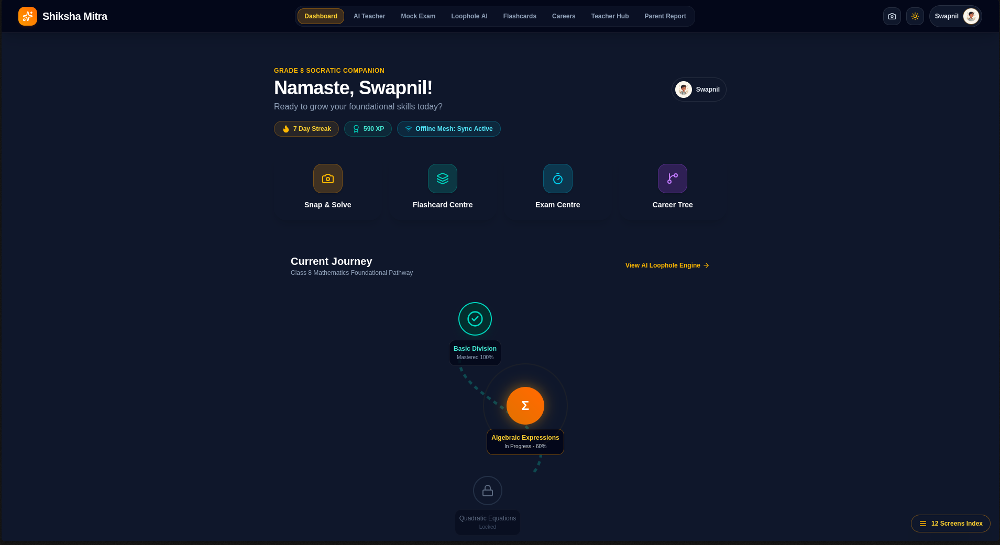
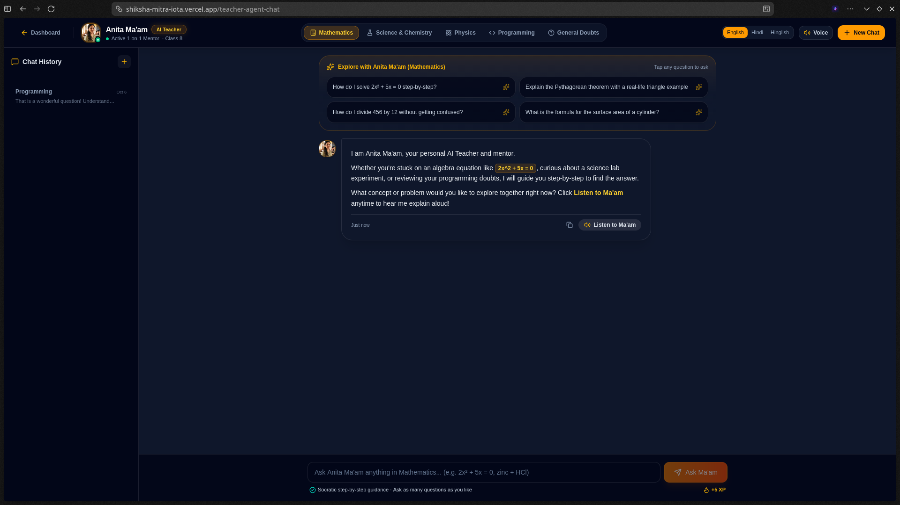
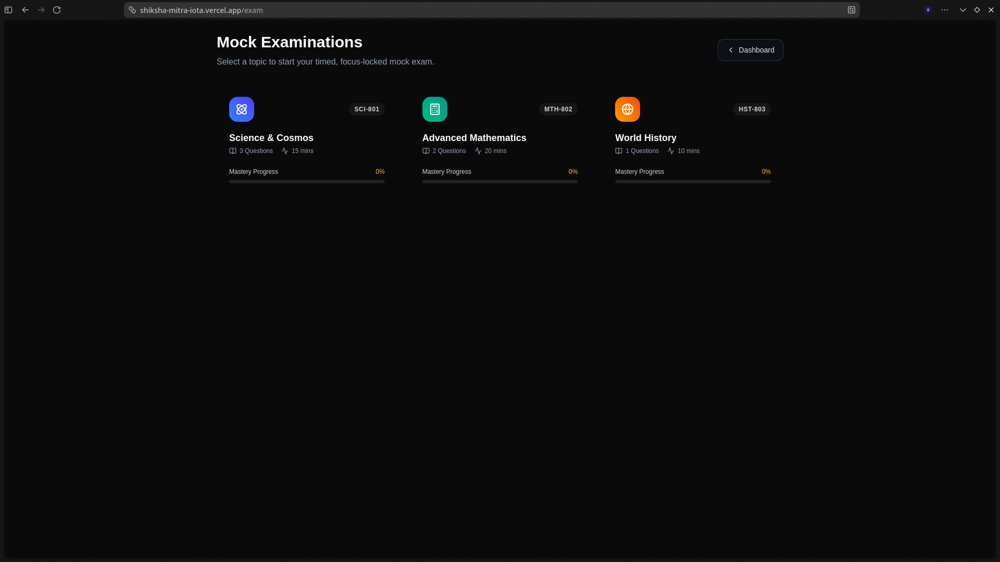
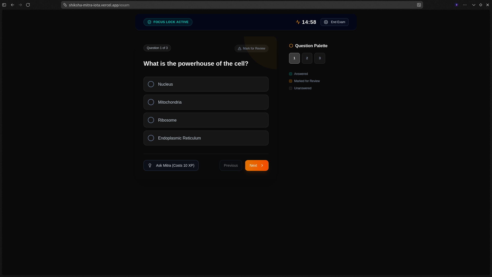
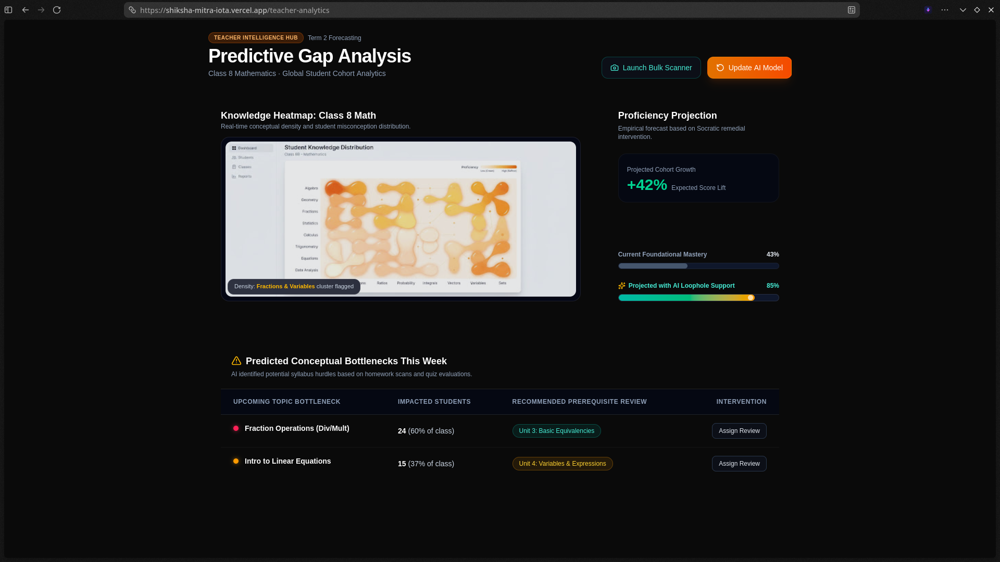
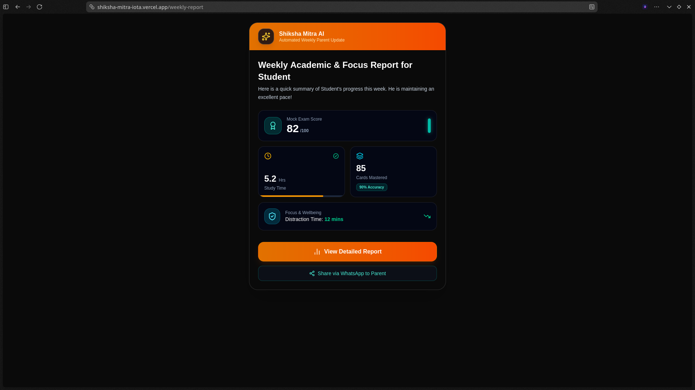

# 🎓 Shiksha Mitra AI

**Shiksha Mitra AI** is a unified, AI-powered education platform designed to bridge the gap between Students, Teachers, and Parents. It leverages artificial intelligence to provide personalized learning, streamline evaluations, and deliver automated insights—all through a single cohesive ecosystem.

---

## 🌟 Key Features

### 🧑‍🎓 For Students
* **Socratic Voice Mentor:** Meet "Anita Ma'am", an interactive AI mentor that guides students to answers using the Socratic method instead of just handing them solutions.
* **Dynamic Mock Exams:** Time-bound, focus-locked assessments that adapt to foundational weaknesses and log real-time analytics.
* **Loophole Diagnostics:** AI automatically identifies conceptual gaps from past mistakes and prescribes targeted flashcards and review materials.

### 👨‍🏫 For Teachers
* **Predictive Gap Analysis:** A cohort-level dashboard mapping out class-wide misconceptions and proficiency projections.
* **Knowledge Heatmaps:** Visualizes student mastery and pinpoints the exact foundational topics where the class struggles.
* **Bulk Assessment:** AI-assisted grading and data aggregation to eliminate administrative overhead.

### 👨‍👩‍👧 For Parents
* **Automated Weekly Reports:** Instant updates on student progress, streak monitoring, and latest mock exam scores.
* **Digestible Insights:** Actionable, WhatsApp-style report cards ensuring parents are always in the loop without feeling overwhelmed.

---

## 📸 Platform Walkthrough

### 1. Unified Student Dashboard
The central hub for navigating learning modules, diagnostics, and upcoming exams.


### 2. AI Teacher (Anita Ma'am)
Voice-enabled, highly empathetic Socratic tutor that speaks multiple vernacular languages.


### 3. Mock Exams Hub
Students can select subjects and dive into rigorous, AI-generated practice tests.


### 4. Active Exam Interface
A clean, distraction-free environment tracking time, responses, and items marked for review.


### 5. Teacher Analytics & Gap Analysis
Real-time tracking of class performance, automatically highlighting "loopholes" in the cohort's understanding.


### 6. Parent Report Cards
Weekly AI-generated summaries covering recent mock exam scores, study hours, and overall growth trajectory.


---

## ⚙️ Tech Stack

* **Frontend:** Next.js (React), Tailwind CSS, Lucide Icons
* **Backend:** Node.js, Express.js, TypeScript
* **Database:** MongoDB (Mongoose)
* **AI Integration:** LLM-powered pedagogical engines, Google TTS
* **Deployment:** Vercel (Serverless Functions for Backend & Next.js Frontend)

---

## 🚀 Quick Start

### 1. Install Dependencies
```bash
bun install
# or npm install / pnpm install
```

### 2. Configure Environment Variables
Create a `.env.local` inside the `frontend/` directory and a `.env` inside the `backend/` directory using your database and API credentials.

### 3. Run Development Servers
Run the backend and frontend simultaneously in separate terminals:

**Terminal 1 (Backend):**
```bash
cd backend
bun run dev
```

**Terminal 2 (Frontend):**
```bash
cd frontend
bun run dev
```

The app will be available at [http://localhost:3000](http://localhost:3000).

---

<div align="center">
Made with ❤️ for education empowerment by <b>Pranav Nere</b> and <b>Swapnil Ingle</b>
</div>
